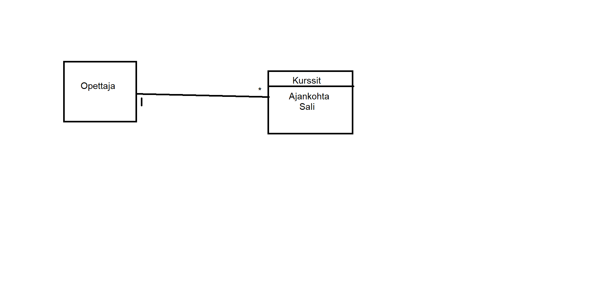

# Tietokannat
### Tehtävä 1  
Omalla nimelläni löytyy kauan sitten kastettuja mm. 1688. Myös nimeni muunnoksia on Sakuds, Sakuas, Sakuis.  
Matti nimellä löytyy taas hyvin vanhoja kastoja 1700 ja 1800-luvulta.  
Maija nimellä löytyy paljon tuloksia ja moni niistä on taas nimimuunnoksia esimerkiksi Maija -> Maja.
### Tehtävä 2
Olen syöttänyt varmaan satoihin palveluihin sähköpostiosoitteeni.
### Tehtävä 3

### Tehtävä 4
SELECT * FROM Kurssisuoritus
### Tehtävä 5
SELECT kurssi FROM Kurssisuoritus
### Tehtävä 6
SELECT DISTINCT kurssi FROM Kurssisuoritus
### Tehtävä 7
SELECT * FROM Opiskelija WHERE nimi = 'Anna'
### Tehtävä 8
Select * FROM Kurssisuoritus WHERE Opiskelija = 'Pihla'
### Tehtävä 9
SELECT * FROM Opiskelija WHERE pääaine LIKE '%tiede%' 
SELECT DISTINCT pääaine FROM Opiskelija WHERE pääaine LIKE '%tiede%'
### Tehtävä 10  
SELECT Kurssi.nimi. Kurssisuoritus.päivämäärä. Kurssisuoritus.arvosana FROM Kurssi, Kurssisuoritus
WHERE Kurssi.kurssitunnus = Kurssisuoritus.kurssi
### Tehtävä 11  
SELECT Opiskelija.nimi, Kurssisuoritus.päivämäärä, Kurssisuoritus.arvosana FROM Opiskelija, Kurssisuoritus 
### Tehtävä 12

